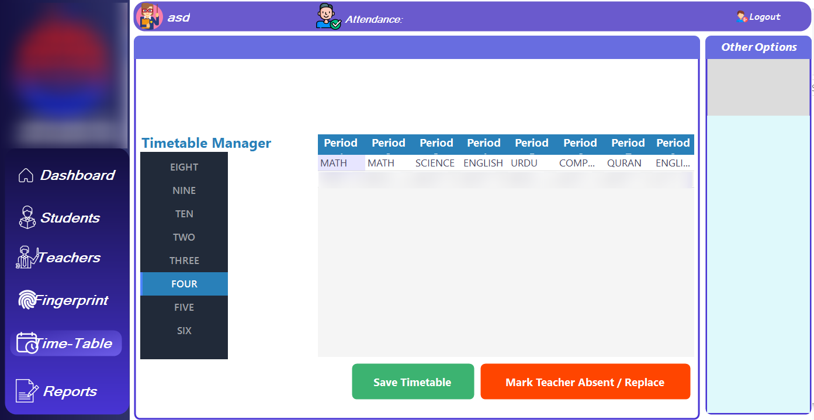

# 📚 School Management System  

[](https://github.com/ibramatrix/SchoolManagementSystem/stargazers)
[](https://github.com/ibramatrix/SchoolManagementSystem/network/members)
[](https://github.com/ibramatrix/SchoolManagementSystem/issues)
[](./LICENSE)


---

## 📑 Table of Contents  
- [About the Project](#-about-the-project)  
- [Features](#-features)  
- [Tech Stack](#-tech-stack)  
- [Installation](#-installation)  
- [Usage](#-usage)  
- [Screenshots](#-screenshots)  
- [Contributing](#-contributing)  
- [License](#-license)  

---

## 📖 About the Project  
The **School Management System** is a **C# Windows Forms application** designed to manage essential school operations, including student data, attendance, exams, results, and more.  
It helps schools digitize their processes and improve efficiency.  

---

## ✨ Features  
✅ Add, update, and delete student records  
✅ Manage classes and sections  
✅ Attendance management system  
✅ Fee collection and reports  
✅ Exam & results management  
✅ Print bills, receipts, and reports  
✅ Dashboard with graphical insights  

---

## 🛠 Tech Stack  
- **Language:** C#  
- **Framework:** .NET (Windows Forms)  
- **Database:** (Add your DB here → SQL Server / MySQL / Firebase etc.)  
- **IDE:** Visual Studio  

---

## ⚙️ Installation  

1. Clone the repository  
   ```bash
   git clone https://github.com/ibramatrix/SchoolManagementSystem.git
   cd SchoolManagementSystem

2.Open the solution file (.sln) in Visual Studio

3.Restore dependencies and build the project

4.Run the application

## 🖼 Screenshots  

### 🏠 Dashboard  
  

### 🎓 Student Management  
  

### 👩‍🏫 Teacher Management  
  

### ☝️ Fingerprint Management
  

### 📝 Time-Table Management
  

### 📊 Reports  


## ▶️ Usage
- Login as **Admin/Staff**  
- Manage students, teachers, classes, and results  
- Generate reports and view analytics  
- Print records when required  

---

## 🛠 Technologies Used
- **C# (WinForms)** – Desktop Application  
- **.NET Framework** – Backend Logic  
- **SQL Server / LocalDB** – Database  

---

## 🤝 Contributing
Contributions are welcome!  

1. Fork the repo  
2. Create a new branch (`feature-xyz`)  
3. Commit your changes  
4. Push to your branch  
5. Open a Pull Request  

---

## 📜 License
This project is licensed under the **MIT License** – see the [LICENSE](LICENSE) file for details.

